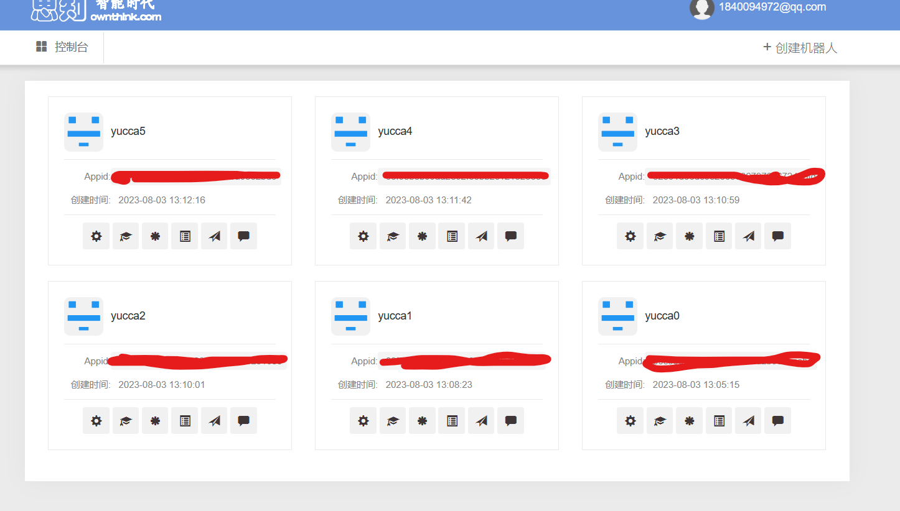

<div align="center">
   </br>
</div>

----
# 🎆鸣谢

- [Mirai框架](https://github.com/mamoe/mirai)
- [CjangCjengh-MoeGoe](https://github.com/CjangCjengh/MoeGoe) vits语音合成功能来源
- [pandora-chatgpt](https://github.com/pengzhile/pandora)    好像已经没了
- [coze-discord-proxy](https://github.com/deanxv/coze-discord-proxy) 通过discord白嫖gpt4
- [MrXiaoM](https://github.com/MrXiaoM)     你懂的
- [arona api](https://doc.arona.diyigemt.com/)  提供blueArchive数据支持
- [Yiri-mirai](https://github.com/YiriMiraiProject/YiriMirai)  很好的python sdk
- [stella](https://www.pixiv.net/artworks/109772665)
- 部分查询功能需要[fireFox浏览器](https://www.firefox.com.cn/) ，不用的话可以不装
- 如果遇到使用问题，请在QQ群628763673反馈


<div align="center">
   </br>
</div>

---
# 🚀部署
**请注意，为便于后续更新，请按照搭建教程进行，如下载源码压缩包进行部署操作不当将无法获取到更新**<br>

<details markdown='1'><summary>git太慢，不得不用源码压缩包，如何确保对接更新？</summary>
如果你确实用的是下载源码压缩包的方式还想要获取更新，解压后不要做任何修改，执行一次setUp.py的 绑定远程仓库，否则将无法通过 更新脚本 更新

</details>
<details markdown='1'><summary>镜像源无法更新</summary>
镜像源似乎都是断头饭，没法更新

</details>

哥们不是学程序设计的，如果你发现了bot存在一些我没有注意到的问题，或者有对项目的建议请及时提issue🎃
### dlc

- [so-vits-svc语音合成](https://github.com/avilliai/Moe-SVC-api)
  - 中文语音合成
- [bert_vits2_sever](https://github.com/avilliai/Bert_Vits2_Sever)
  - 更强大的中文语音合成
- [bert_vits2_sever.colab](https://colab.research.google.com/drive/1n8lI6pOiDtli2zC5fL9PZ9TZqbOafqma?usp=sharing)
  - 更强大的中文语音合成，使用colab，不占用本地资源
- [Berglm](https://github.com/avilliai/Bergml)
  - 轻量版Manyana，无需部署环境，双击即可运行。仅保留部分功能
- [NTManyana(NTQQ)](https://github.com/avilliai/NTManyana)
  - 适用于NTQQ的Manyana
- [Cyumis](https://github.com/avilliai/Cyumis)
  - 基于官方api的版本，需要先在 https://q.qq.com/qqbot/#/developer/developer-setting 获取token和secret
## 方法1：搭建工具部署(推荐)
**如果你觉得自己从零开始搭建bot比较困难，请使用此方案**
- 从release下载ManyanaLauncher.rar并解压
- 双击launcher.exe
- 从release下载HowToUse.mp4，如有疑问参考视频即可
## 方法2：自行部署(如果你有一定bot搭建经验)
- 请确保py版本为3.9
- 请确保已安装[mirai-api-http](https://github.com/project-mirai/mirai-api-http) 并[正确配置](https://github.com/avilliai/wReply/blob/master/setting.yml)
### 操作步骤
- 从release下载setUps.rar并解压，依次安装，一般默认下一步就行(**安装python的第一步一定要先勾选add to path**)。apk安装到手机。
- 克隆本仓库。找一个你喜欢的目录(**不要带中文**)打开cmd或git bash执行
```
git clone https://github.com/avilliai/Manyana.git
或使用镜像源
git clone https://gitclone.com/github.com/avilliai/Manyana
```
- 双击Manyana/一键部署脚本.bat即可
- 把release的模型(1374_epochsm.pth)文件放置在Manyana/vits/voiceModel/nene
- 运行一次Manyana/更新脚本.bat 以补全最近更新的内容
## 不管你用哪种搭建方式
- 填写config.json(必做)与config/api.yaml(建议填写)
- 启动bot
  - 工具搭建：Launcher.exe会帮助你启动
  - 自行搭建：启动你自己的mirai，以及Manyana/启动脚本.bat
```
{"botName": "机器人名字", "botQQ": "机器人QQ", "master": "你的QQ", "mainGroup": "你自己群的群号","vertify_key": "这里写你http-api的key,尖括号不用带", "port": "httpapi的运行端口"}
下面是一个填写示例实例
{"botName": "Manyana", "botQQ": "1283992481", "master": "1840094972","mainGroup": "628763673", "vertify_key": "1234567890", "port": "23456"}
```

---
# 🍩功能
readme的更新并不及时，每次更新都重写readme太累了
- 查看config文件夹下的几个help.png，它们是bot的菜单
- 或搭建后在群内发送@bot 帮助 以查看功能列表
  (plugins文件夹内的函数基本都可以单独拿出去用)


<details markdown='1'><summary>图片相关</summary>

### 获取壁纸
```
@bot [数量]张[tag]             #获取[数量]张标签为[tag]的图，可传r18参数但可能发不出    
2张(壁纸|图)            # 区别于上一个指令，这里不用艾特且出图完全随机。满足如下正则表达式即可触发 r".*(壁纸|图|pic).*(\d+).*|.*(\d+).*(壁纸|图|pic).*"
```
### 图片评级(成人指数)
```
ping[图片]
```
### 搜图
```
搜图[图片]
```
</details>

<details markdown='1'><summary>ai类功能</summary>

```
chatGLM 配置文件打开glmReply或trustglmReply，将取代艾特回复
     设置密钥#apiKey       #从https://open.bigmodel.cn/usercenter/apikeys复制apiKey
     取消密钥              #取消本群的密钥
     可用角色模板          #查看所有可用角色预设，需要填写setting.yaml
     设定#角色名           #设置特定角色回复
/g你好       #谷歌的gemini，需要配置api.yaml
/xh你好      #讯飞星火，无需配置
/wx你好      #文心一言，无需配置
/l你好       #无需配置的chatgpt3.5
/y你好       #无需配置的chatgpt3.5
/chat你好    #无需配置的chatgpt3.5
/p[你的文本，不要带括号]    config/token.txt中填写你的token，获取方式见https://ai-20230626.fakeopen.com/auth
/poe[你的文本，不要带括号]  你需要填写api.yaml中的内容，抓取方式看https://github.com/avilliai/Poe_QQ
/rwkv[你的文本，不要带括号]    需要在本地部署rwkv模型，具体看https://www.bilibili.com/video/BV1hM4y1v76R/?vd_source=b41b8c06d400241b8d0badbe1f821ec9
```

</details>

<details markdown='1'><summary>自定义词库</summary>

```
开始添加            #此指令用于开始词库添加，仅在当前群生效
删除#关键词         #例如　删除#孙笑川   用于删除指定回复　
del#关键词         #直接删除整个关键词以及所有回复

*开始添加           #为所有群的词库添加
*del#关键词        #为所有群的词库删除

导入词库　　　　　　　#从config/词库.xlsx导入词库
nameXXX           #设定bot对你的特殊称谓为XXX，例如 name丁真珍珠　
```
除此之外，你也可以打开data/autoReply/lexicon进行修改，完成后在群内发送 导入词库

在这个文件夹下，分为三类词库

| 词库类型   | 名称                 | 作用                |
|--------|--------------------|-------------------|
| 共有词库(1) | public.xlsx        | 理解为bot预置角色卡，一般不用管 |
| 共有词库(2) | publicLexicon.xlsx | 关键词回复的公有词库，一般操作它  |
| 群专有词库  | 群号.xlsx            | 各群关键词回复的专有词库      |
| 初始化词库  | init.xlsx          | 各群创建专有词库的初始化添加内容  |

**总之就是所有群创建专有词库的时候，都是从init.xlsx复制, 而共有词库是bot在所有群通用的词库。**

你可以添加语音回复，但回复本身就有一定几率转为语音回复。
</details>

<details markdown='1'><summary>vits语音合成</summary>

使用sp查看所有可用角色，或@bot 可用角色
```
xx说 yourText             # 通过角色名，指定一个角色模型
xx中文yourText            # 此模式下输出为中文
xx日文yourText            #输入日文，输出日文
设定角色#角色名             #指定一个默认语音合成角色
你也可以不带角色名直接@bot 说 或者使用其他两个指令
```
#### 导入模型：
在vits/voiceModel文件夹下新建一个文件夹放置.pth文件和config.json文件，重启main.py即可

**注意，如果你的语音模型只支持一种语言，请将模型名称从XXX.ptj改为XXXI.pth**，以I.pth结尾是项目辨别此类模型的方式<br>

</details>

<details markdown='1'><summary>信息查询</summary>

### 游戏攻略/游戏信息查询
```
/arona            #查看可查询项目，随后使用例如 /arona项目名来使用。
ba查询[角色名]      # ba查询优香 查询一个角色信息
战双查询[角色名]    需要[fireFox浏览器](https://www.firefox.com.cn/)
方舟查询[角色名]    需要[fireFox浏览器](https://www.firefox.com.cn/)
王者荣耀查询[角色名]
```
### 历史上的今天
```
@bot 历史上的今天      # 满足正则表达式 r".*史.*今.*|.*今.*史.*" 即可触发
```
### 天气查询
```
查询cityName         #例如查询郑州
```
### 新闻
```
@bot 新闻
```
### 摸鱼人日历
```
@bot 摸鱼
```
### nasa每日天文
```
@bot 天文
```
</details>

<details markdown='1'><summary>群管与好友</summary>

这部分可以操作config/settings.yaml
### 加好友与加群
```
群内发送 签到     #跟随指引完成签到后大概一分钟后可添加好友，签到2天后可邀请bot加群
```
这将需要你的城市信息，仅用于获取天气信息以完善签到图片
### 群管
#### 关键词审核
````
添加违禁词XXX
删除违禁词XXX
@bot 查看违禁词
````
#### 涩图审核撤回
```
设置审核密钥[apiKey]      #需要先在群内设置一个单独的密钥以开启此功能,示例：设置密钥207b10178c64089dvzv90ebfcd7f865d97a
                        #从https://www.moderatecontent.com/获取,master使用此指令无论输入什么密钥都将默认采用api.yaml中的审核密钥。例如  设置审核密钥1163yyfahf
/moderate       #开启/关闭本群涩图审核
/阈值50          #设置撤回阈值为50，越涩的图对应的数值越高。阈值越小越容易撤回图片
```
</details>

<details markdown='1'><summary>master指令</summary>

## master指令
```
设定角色#角色名   #为语音功能设置一个默认的角色
授权#qq号       #给一个用户授权(群内发送)
授权群#群号      #授权群的同时会自动创建一个词库
退群#群号       #退出指定群
/bl add qq号   #拉黑一个用户
/bl remove qq号   #取消拉黑
/blgroup add 群号
/blgroup remove 群号
notice         # 群发通知用
/quit<10      #退出所有10人以下的无授权群，你可以修改人数，比如/quit<7都可以
/allclear   #把所有人的chatglm聊天记录清除
.system     #查看当前系统信息
```
</details>

<details markdown='1'><summary>其他</summary>

## 小功能
```
截图#url     #打开指定网页并截图
meme         #抽取一张meme图
运势          #是阿喵喵版本的运势卡
今日塔罗       #塔罗牌
/苏联笑话      #还有/法国笑话 等类似指令
/cp user1 user2   # xxs最喜欢的cp文，但有一说一文笔真不咋地(不是我写的)
干员生成        #我超，粥
原神，启动       # 原神抽签
@bot 诗经      #获取一篇诗经
@bot 周易     #高科技算命
/赌 3       #轮盘赌
星铁十连
方舟十连
ba十连
点歌 歌曲名
```
</details>

<details markdown='1'><summary>定时任务推送</summary>

```
- /推送 摸鱼人日历
- /推送 每日天文
- /推送 每日新闻
- /推送 喜加一
- /推送 每日星座
- /推送 单向历
- '=========='
- /取消 摸鱼人日历
- /取消 每日天文
- /取消 每日新闻
- /取消 喜加一
- /取消 每日星座
- /取消 单向历
```
</details>

<details markdown='1'><summary>TODO</summary>

- [ ] 能够白嫖的ai绘图
</details>

# 🎲可选配置
<details markdown='1'><summary>填写配置文件</summary>

有关配置文件的填写，config文件夹每个yaml文件基本都有注释，每个yaml文件几乎都是可供修改的，这里给出部分文件的修改指引，以便于您能够更好的了解如何自定义您的的bot
#### 戳一戳回复
打开config/nudgeReply.yaml即可
```
BeatNudge:         #戳一戳反击的第一条消息
- 生气了哦！
BeatNudge1:       #戳一戳反击后的消息
- 你是笨蛋吗
chineseVoiceRate: 30    #中文语音回复几率
defaultModel:         #默认语音模型
  modelSelect:        
  - voiceModel/nene/1374_epochsm.pth
  - voiceModel/nene/config.json
  speaker: 2
nudgedReply:        #正常戳一戳的回复
- 呜哇，好害羞啊……不过……
- en?
prob: 9            #反击几率
voiceReply: 50    # 戳一戳转语音几率

```
#### 定时任务配置
```
news:
  groups:                           #推送任务的群
  - 699455559                          
  text: 早上好，这里是今天的新闻            #推送时的附带信息
  time: 8/2                             #定时任务的时间，这里意为8:02,写作8/2
```
</details>

<details markdown='1'><summary>使用ai回复替代词库回复</summary>

> 使用chatglm或gpt3.5进行回复
### chatglm(推荐) 
- 根据api.yaml的指引注册并获取apikey,填写进api.yaml中，价格还是比较便宜的注册送的18一般够用半年以上。 
- 打开setting.yaml 填写chatglm相关配置项即可
### gpt3.5
- 此api不稳定，请酌情使用
- 无需配置apikey
- 打开setting.yaml 填写luoyue或yuban的相关配置项即可

### 思知ai
> 这里是如何使用免费的思知ai进行回复的教程，目前已不推荐，推荐使用上面的chatglm
>release有对应的知识库(sizhi.rar)用以导入思知控制台
- [登录并创建多个bot](https://console.ownthink.com/login)
- 
- 点击设置旁边的知识库，进入后如下
- 
- 点击上传txt文本，选择解压后的sizhi.rar中的任一个。每个创建的bot对应一个知识库，完成后点击训练。
- 记录你所有的的Appid，回到Manyana/api.yaml，填入siZhiAi中
- 在settings.yaml打开思知ai回复

</details>

# 🚑可能遇到的问题

<details markdown='1'><summary>内存不够bot总是意外结束运行</summary>

>服务器内存2G一般完全够用，但不排除你想整点其他的，导致内存可能不够用
- 确保更新到了最新版Manyana
- 把vits文件夹中的所有内容(所有文件和文件夹)复制到Manyana根目录
- 重新启动bot即可
>launcher启动的时候支持指定内存
- 你回车就是512mb
- 调小或者调大都试试，很诡异，有调小能用的，也有调大能用的

</details>

<details markdown='1'><summary>更新不了是怎么回事</summary>

>往往是因为你自定义过的文件在仓库这边的母版又有了变动，所以会导致冲突，这时更新会列出冲突的文件
- 重命名你的冲突的文件，不要与原来一样
- 更新，拉取新的文件
- 根据旧的文件**填写**新的对应文件
>另一种情况是你连不上git服务器，那最好找个代理并配置git代理吧，裸连纯看运气，不是很稳

</details>

# 🎄最后
如果觉得项目还不错的话给个star喵，给个star谢谢喵


## 快速克隆
<div>
    <a href='https://gitclone.com'></a>
</div>
