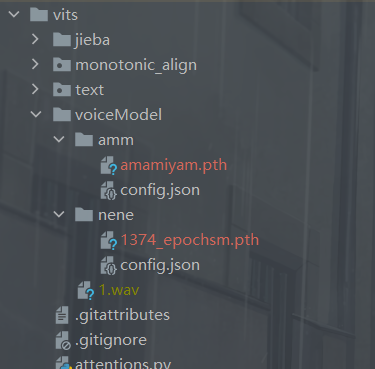
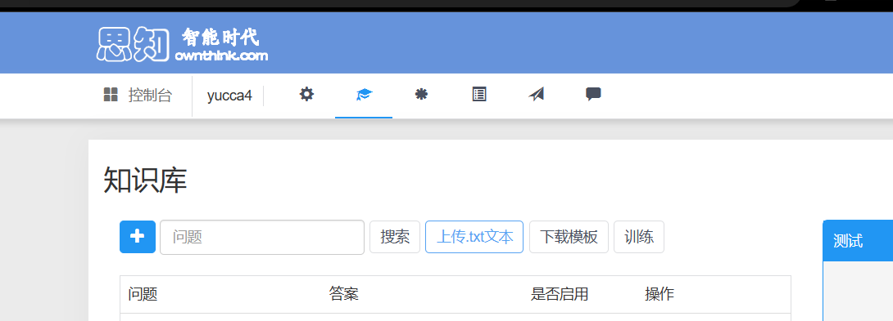

<div align="center">
   </br>

   

----


Manyana基于[Mirai框架](https://github.com/mamoe/mirai) ，使用了[YiriMirai](https://github.com/YiriMiraiProject/YiriMirai) 以进行更便捷的开发。

封面图片来源于[stella](https://www.pixiv.net/artworks/109772665) ,很漂亮的ai绘画。

Manyana指
     <p>佛教中的末那识，它是介于意识(第六识)与阿赖耶识(第八识)之间的第七识</p>
     <p>它是当下的感官经验与更本原性的阿赖耶识——一切现象的种子之间的桥梁。这很抽象所以我用它做了新项目的名字</p>

</div>

- 项目使用了CjangCjengh的[MoeGoe](https://github.com/CjangCjengh/MoeGoe) 以及他的语音模型
- 项目使用了pengzhile的[pandora](https://github.com/pengzhile/pandora)
- 基于[Yiri-mirai](https://github.com/YiriMiraiProject/YiriMirai) 实现
- 请确保已安装[fireFox浏览器](https://www.firefox.com.cn/)
- 如果遇到使用问题，请在QQ群628763673反馈
- **如果遇到code45问题，请使用[NTManyana(NTQQ)](https://github.com/avilliai/NTManyana)**
# 部署
**请注意，为便于后续更新，请按照搭建教程进行，如下载源码压缩包进行部署操作不当将无法获取到更新**<br>
mirai版本(本贴)与[NTManyana(NTQQ)](https://github.com/avilliai/NTManyana)
## 方法1：搭建工具部署(推荐)
**如果你觉得搭建bot过于困难，请使用此方案**
- 从release下载ManyanaLauncher.rar并解压(rar是一种压缩文件格式，不知道怎么用自己去下个winrar)
- 从release下载HowToUse.mp4，如有疑问参考视频即可
- **使用搭建工具搭建完成后请务必运行一次Manyana/setUp.py补全最近更新的内容**
## 方法2：自行部署(如果你有一定bot搭建经验)
- 请确保py版本为3.9
- 请确保已安装[mirai-api-http](https://github.com/project-mirai/mirai-api-http) 并[正确配置](https://github.com/avilliai/wReply/blob/master/setting.yml)
- 可选安装[mirai-login-solver-sakura](https://github.com/KasukuSakura/mirai-login-solver-sakura)
- 可选安装[Mirai点歌插件](https://github.com/khjxiaogu/MiraiSongPlugin)
- 可选安装[PetPet](https://github.com/Dituon/petpet)
### 操作步骤
- 从release下载setUps.rar并解压，依次安装，一般默认下一步就行(**安装python的第一步一定要先勾选add to path**)。apk安装到手机。
- 特别地，对于watt Toolkit，开始加速前一定要勾选上加速github。不过你既然都到这里了，想必也用不到它。
- 克隆本仓库。找一个你喜欢的目录(**不要带中文**)打开cmd或git bash执行
```
git clone https://github.com/avilliai/Manyana.git
```
- 解压release中的site-packages.rar，打开cmd输入where python查看你的python安装目录
- 进入python安装目录，找到Lib/site-packages，用release的site-packages替换它
- 运行一次Manyana/setUp.py以补全最近更新的内容
## 不管你用哪种搭建方式
- 填写config.json(必做)与config/api.yaml(建议填写)
- 然后运行main.py(如使用搭建工具部署，launcher内置了启动Manyana的脚本,无需手动启动main.py)
```
{"botName": "机器人名字", "botQQ": "机器人QQ", "master": "你的QQ", "mainGroup": "你自己群的群号","vertify_key": "这里写你http-api的key,尖括号不用带", "port": "httpapi的运行端口"}
下面是一个填写示例实例
{"botName": "Manyana", "botQQ": "1283992481", "master": "1840094972","mainGroup": "628763673", "vertify_key": "1234567890", "port": "23456"}
```

# 功能
发送@bot 帮助 以查看功能列表，readme的更新并不及时
## 图片相关
### 获取壁纸
```
@bot [数量]张[tag]             #获取[数量]张标签为[tag]的图，可传r18参数但可能发不出    
2张(壁纸|图)            # 区别于上一个指令，这里不用艾特且出图完全随机。满足如下正则表达式即可触发 r".*(壁纸|图|pic).*(\d+).*|.*(\d+).*(壁纸|图|pic).*"
```
### 图片评级(成人指数)
```
ping[图片]
```
### 搜图
```
搜图[图片]
```
## ai回复
```
chatGLM 详情查看配置文件，将取代艾特回复
     设置密钥#apiKey       #从https://open.bigmodel.cn/usercenter/apikeys复制apiKey
     取消密钥              #取消本群的密钥
     可用角色模板          #查看所有可用角色预设，需要填写setting.yaml
     设定#角色名           #设置特定角色回复
/xh你好      #讯飞星火
/wx你好      #文心一言
/p[你的文本，不要带括号]    config/token.txt中填写你的token，获取方式见https://ai-20230626.fakeopen.com/auth
/poe[你的文本，不要带括号]  你需要填写api.yaml中的内容，抓取方式看https://github.com/avilliai/Poe_QQ
/rwkv[你的文本，不要带括号]    需要在本地部署rwkv模型，具体看https://www.bilibili.com/video/BV1hM4y1v76R/?vd_source=b41b8c06d400241b8d0badbe1f821ec9
```
## 自定义回复
```
开始添加            #此指令用于开始词库添加，仅在当前群生效
删除#关键词         #例如　删除#孙笑川   用于删除指定回复　
del#关键词         #直接删除整个关键词以及所有回复

*开始添加           #为所有群的词库添加
*del#关键词        #为所有群的词库删除

导入词库　　　　　　　#从config/词库.xlsx导入词库
nameXXX           #设定bot对你的特殊称谓为XXX，例如 name丁真珍珠　
```
除此之外，你也可以打开data/autoReply/lexicon进行修改，完成后在群内发送 导入词库

在这个文件夹下，分为三类词库

| 词库类型   | 名称                 | 作用                |
|--------|--------------------|-------------------|
| 共有词库(1) | public.xlsx        | 理解为bot预置角色卡，一般不用管 |
| 共有词库(2) | publicLexicon.xlsx | 关键词回复的公有词库，一般操作它  |
| 群专有词库  | 群号.xlsx            | 各群关键词回复的专有词库      |
| 初始化词库  | init.xlsx          | 各群创建专有词库的初始化添加内容  |

**总之就是所有群创建专有词库的时候，都是从init.xlsx复制, 而共有词库是bot在所有群通用的词库。**

你可以添加语音回复，但回复本身就有一定几率转为语音回复。
## vits语音合成
使用sp查看所有可用角色，或@bot 可用角色
```
xx说 yourText             # 通过角色名，指定一个角色模型
xx中文yourText            # 此模式下输出为中文
xx日文yourText            #输入日文，输出日文
设定角色#角色名             #指定一个默认语音合成角色
你也可以不带角色名直接@bot 说 或者使用其他两个指令
```
### 导入模型：
在vits/voiceModel文件夹下新建一个文件夹放置.pth文件和config.json文件，重启main.py即可

**注意，如果你的语音模型只支持一种语言，请将模型名称从XXX.ptj改为XXXI.pth**，以I.pth结尾是项目辨别此类模型的方式

## 信息查询
### 碧蓝档案wiki
```angular2html
ba查询[角色名]      # ba查询优香 查询一个角色信息
```
### 战双wiki
```
战双查询[角色名]
```
### 明日方舟wiki
```
方舟查询[角色名]
```
### 王者荣耀查战力/英雄
```js
王者荣耀查询
```
### 历史上的今天
```
@bot 历史上的今天      # 满足正则表达式 r".*史.*今.*|.*今.*史.*" 即可触发
```
### 天气查询
```
查询cityName         #例如查询郑州
```
### 新闻
```
@bot 新闻
```
### 摸鱼人日历
```
@bot 摸鱼
```
### nasa每日天文
```
@bot 天文
```

## 好友与加群管理
### 加好友与加群
```
群内发送 签到     #跟随指引完成签到后大概一分钟后可添加好友，签到2天后可邀请bot加群
```
这将需要你的城市信息，仅用于获取天气信息以完善签到图片
### 群管
#### 关键词审核
````
添加违禁词XXX
删除违禁词XXX
@bot 查看违禁词
````
#### 涩图审核撤回
```
设置审核密钥[apiKey]      #需要先在群内设置一个单独的密钥以开启此功能,示例：设置密钥207b10178c64089dvzv90ebfcd7f865d97a
                        #从https://www.moderatecontent.com/获取,master使用此指令无论输入什么密钥都将默认采用api.yaml中的审核密钥。例如  设置审核密钥1163yyfahf
/moderate       #开启/关闭本群涩图审核
/阈值50          #设置撤回阈值为50，越涩的图对应的数值越高。阈值越小越容易撤回图片
```
## 定时任务
```

```
## 小功能
```
截图#url     #打开指定网页并截图
meme         #抽取一张meme图
运势          #是阿喵喵版本的运势卡
今日塔罗       #塔罗牌
/苏联笑话      #还有/法国笑话 等类似指令
/cp user1 user2   # xxs最喜欢的cp文，但有一说一文笔真不咋地(不是我写的)
干员生成        #我超，粥
原神，启动       # 原神抽签
@bot 诗经      #获取一篇诗经
@bot 周易     #高科技算命
```
## master指令
```
设定角色#角色名   #为语音功能设置一个默认的角色
授权#qq号       #给一个用户授权(群内发送)
授权群#群号      #授权群的同时会自动创建一个词库
退群#群号       #退出指定群
/bl add qq号   #拉黑一个用户
/bl remove qq号   #取消拉黑
/blgroup add 群号
/blgroup remove 群号
notice         # 群发通知用
```
# 可选配置
## 设置api_key
打开config/api.yaml填写对应信息即可，有道必须填，其他的你随意。
## 戳一戳回复
打开config/nudgeReply.yaml即可
```
BeatNudge:         #戳一戳反击的第一条消息
- 生气了哦！
BeatNudge1:       #戳一戳反击后的消息
- 你是笨蛋吗
chineseVoiceRate: 30    #中文语音回复几率
defaultModel:         #默认语音模型
  modelSelect:        
  - voiceModel/nene/1374_epochsm.pth
  - voiceModel/nene/config.json
  speaker: 2
nudgedReply:        #正常戳一戳的回复
- 呜哇，好害羞啊……不过……
- en?
prob: 9            #反击几率
voiceReply: 50    # 戳一戳转语音几率

```
## 自定义回复相关
你可以对它进行修改，但一般建议使用默认设置
```

signTimes: 3    # 签到几天后可以邀请加群，需保持GroupSensor关闭
GroupSensor: False    #开启后，将拒绝无授权群的加群邀请，signTimes将失效
wReply:
  banWords:       #违禁词
  - 废物
  - 主人
  chineseVoiceRate: 30     #中文回复几率
  replyRate: 3         #共有词库不艾特时的回复几率
  groupLexicon: 100    #各群专有词库不艾特时的回复几率（调这个就行，没有匹配到时，根据replyRate调用共有词库进行回复）
  sizhi: false          #是否启用思知ai
  turnMessage: true    #是否开启私聊转发
  voiceRate: 40        #语音回复几率，过高将增大设备负担
  MaxAllowableLength: 7   #最大允许字符长度倍数,该参数为7时,如果字符串总长为关键字长度的7倍以上，则不进行匹配。如关键词是 早 ,可以匹配 早上好 ,不会匹配 我早就把作业做完了
  AutoCreatLexicon: False #加群之后是否自动创建群专属词库(根据init.xlsx),常规的创建方式是 master发送 授权群#群号 或者有群员在群里发送 开始添加。如果你的群比较多(100以上，不建议开启，除非是广告机器人)


```
# 使用思知ai
这比我写的自定义回复更好用，推荐。release有对应的知识库(sizhi.rar)用以导入思知控制台
- [登录并创建多个bot](https://console.ownthink.com/login)
- 
- 点击设置旁边的知识库，进入后如下
- 
- 点击上传txt文本，选择解压后的sizhi.rar中的任一个。每个创建的bot对应一个知识库，完成后点击训练。
- 记录你所有的的Appid，回到Manyana/api.yaml，填入siZhiAi中
- 在settings.yaml打开思知ai回复
# 最后
如果觉得项目还不错的话给个star喵，给个star谢谢喵


